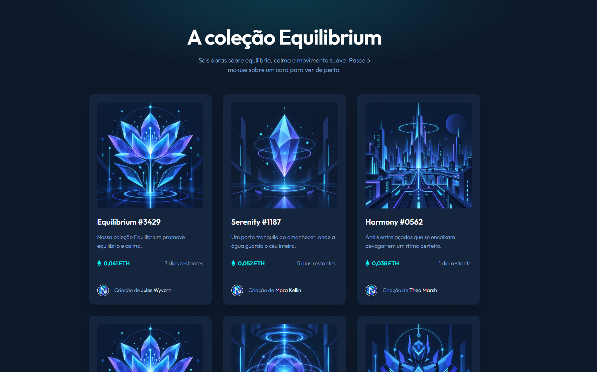
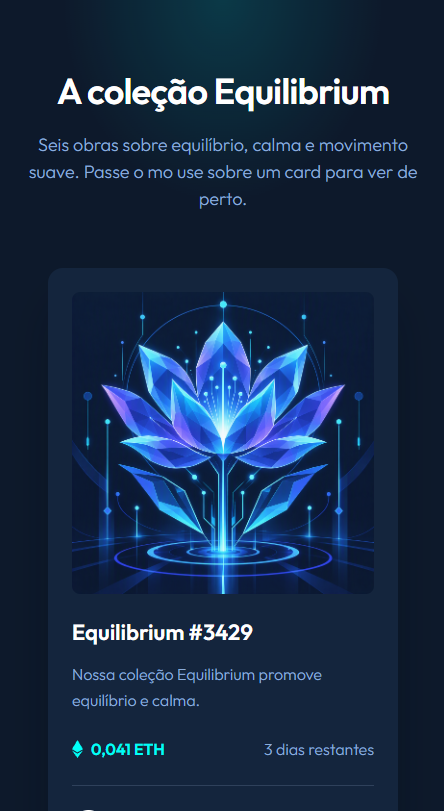

# Equilibrium — Galeria de NFTs

Projeto do **Desafio Portfólio 1.0**: um componente de card de NFT que evoluiu para uma lista de cards com animações e um header responsivo. Feito com HTML5 e CSS, com um pequeno script para as animações de entrada.

📁 **Repositório:** https://github.com/luisbagi-sketch/portifolio-3.git

## Prévia

| Desktop | Celular |
| --- | --- |
|  |  |

## Fases do desafio

| Fase | O que foi feito | Branch |
| --- | --- | --- |
| 1.0 — CardNFT | Card fiel ao design do [Frontend Mentor](https://www.frontendmentor.io/challenges/nft-preview-card-component-SbdUL_w0U), responsivo e com efeito de hover | `feature/nft-card` |
| 1.1 — CardList | Lista com 6 cards, imagens geradas no Leonardo.ai e animações com Animate.css | `feature/card-list` |
| 1.2 — Header | Logo criada no Leonardo.ai e header responsivo com menu para celular | `feature/header` |
| Documentação | Prints da aplicação e este README | `docs/readme` |

## Funcionalidades

- Layout responsivo (celular e computador) com CSS Grid e Flexbox
- Hover no card: o card sobe, a imagem dá um leve zoom, aparece uma camada ciano com o ícone de visualização e os links ficam ciano
- Animação de entrada dos cards ao rolar a página (`fadeInUp`, do Animate.css), com pequeno atraso entre os cards da mesma linha
- Header fixo no topo, com menu hambúrguer no celular (sem JavaScript)
- Respeita a opção "reduzir movimento" do sistema e tem foco visível para navegação pelo teclado


## Estrutura de pastas

```
├── css/
│   ├── base.css        # reset, cores e tipografia
│   ├── card.css        # componente do card
│   ├── card-hover.css  # efeitos de hover
│   ├── cardlist.css    # grade da lista de cards
│   └── header.css      # header e menu do celular
└── docs/               # prints usados neste README
├── images/             # imagens dos cards, avatares e logo
├── js/
│   └── reveal.js       # animação de entrada ao rolar
└── index.html               # página

```

## Autores

| Nome | GitHub |
| --- | --- |
| Larissa Prado Araldo | [@Larissalari99](https://github.com/Larissalari99) |
| Luis Gustavo Guisone Bagi | [@luisbagi-sketch](https://github.com/luisbagi-sketch) |

---

O design do card é do desafio do [Frontend Mentor](https://www.frontendmentor.io?ref=challenge).